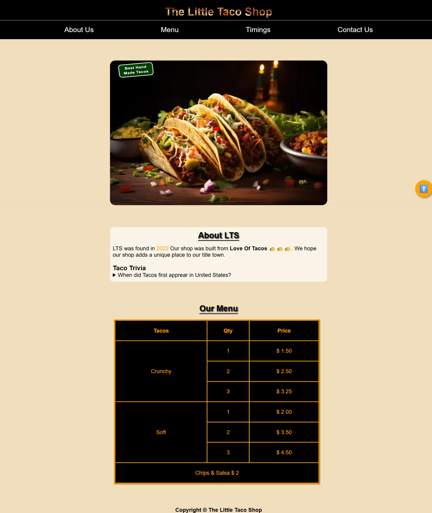
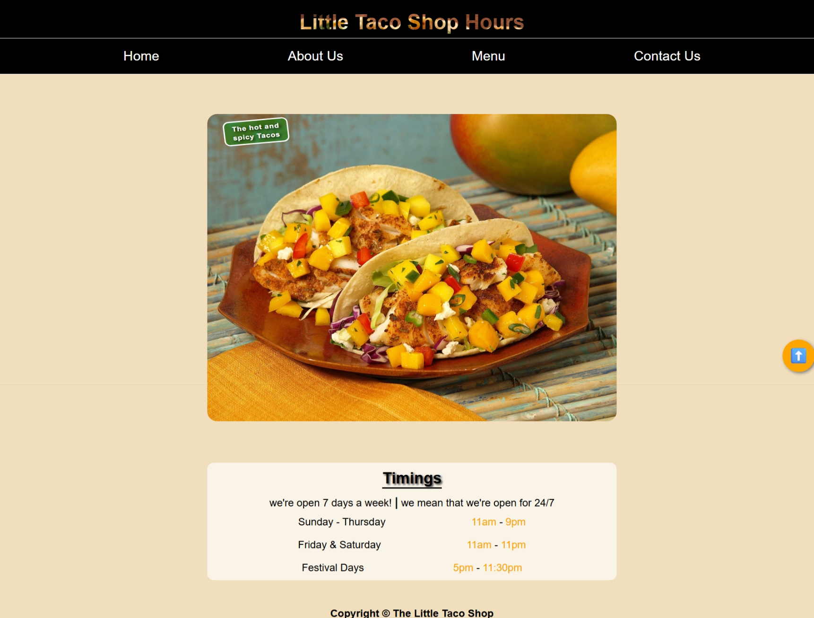
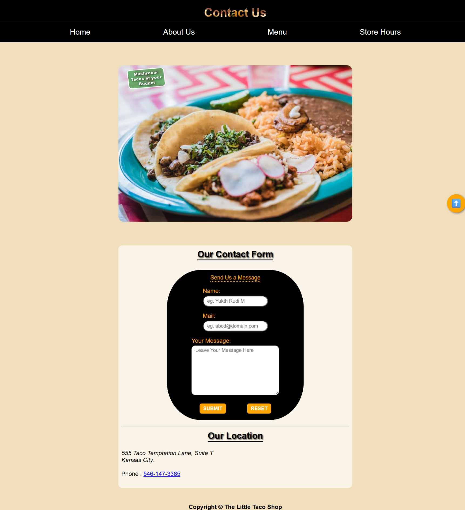

# The Little Taco Shop 🌮

Welcome to **The Little Taco Shop**!  
A fun, responsive, and visually appealing website for a fictional taco restaurant, built to practice and showcase modern HTML and CSS skills. Also this is my first project using HTML and CSS.

## 🌟 Features

- **Responsive Design:** Looks great on all devices.
- **Sticky Header & Navigation:** Easy access to all sections from anywhere on the page.
- **Multiple Pages:**  
  - Home (About Us, Menu)
  - Store Hours
  - Contact Us (with a working contact form)
- **Modern UI:** Uses CSS custom properties, flexbox, and media queries.
- **Accessible:** Semantic HTML, proper labels, and navigation.
- **Fun Visuals:** Tasty taco images, animated buttons, and a scroll-to-top button.

## 📁 Project Structure

```plaintext
taco_web/ 
├── taco_home.html # Home page (About, Menu)
├── taco_sh.html # Store Hours page
├── taco_help.html # Contact Us page
├── taco_home.css # Main stylesheet
├── tacos_images/ # Taco images for the site
```


## 🧑‍💻 What I Practiced

- Semantic HTML5 structure
- Responsive layouts with flexbox and media queries
- CSS custom properties (variables)
- Styling forms and tables
- Accessibility best practices
- Using favicon and Google Fonts
- Simple CSS animations

## 🚀 How to Use

1. **Clone or Download** this repository.
2. Open any of the `.html` files in your browser.
3. All styles and images are included locally (no build step required).

## 📸 Screenshots

### Home Page  


### Store Hours  


### Contact Us  


## 🔗 Links

The live site is up and available [here](https://adhik-6.github.io/taco_shop/).

## 📚 Credits

- Taco images from Unsplash/Pexels (or your own images)
- [Google Fonts - Material Symbols](https://fonts.google.com/icons)
- [Favicon](C:\Users\adhik\PycharmProjects\styling(css)\images\tacos\taco-logo1.webp)

## Acknowledgments

- I learned basic HTML and CSS concepts through this [HTML](https://youtu.be/kUMe1FH4CHE?si=MX1EwNO6EJGGic7T) and [CSS](https://youtu.be/OXGznpKZ_sA?si=Ly4-aC5mPY-QgtIm) videos by FreeCodeCamp.
  
---

> **Note:** This project is for learning and demonstration purposes only.  
> No backend or real data is used.

---

Enjoy your tacos! 🌮
